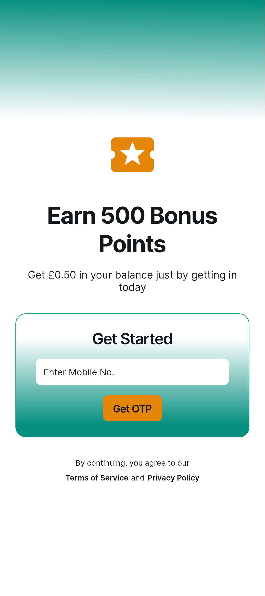
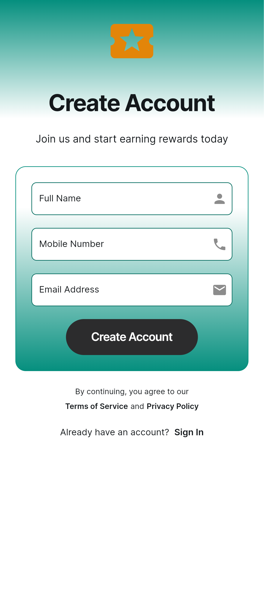
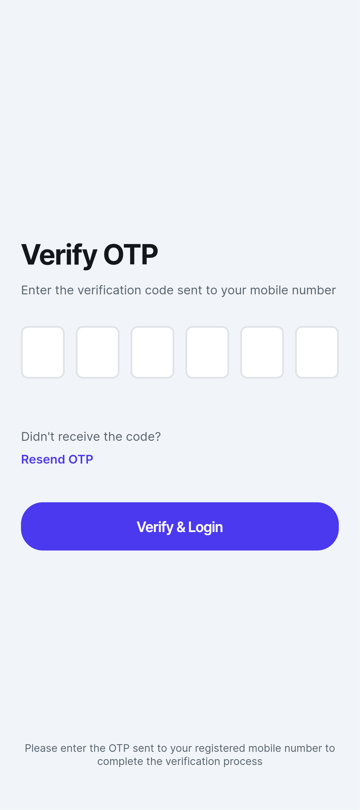
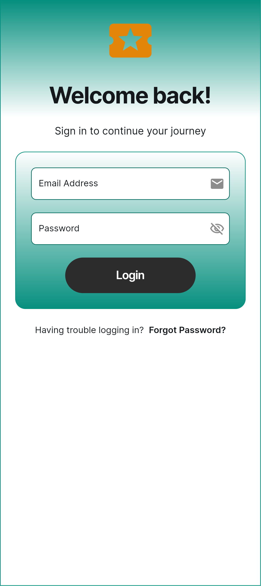
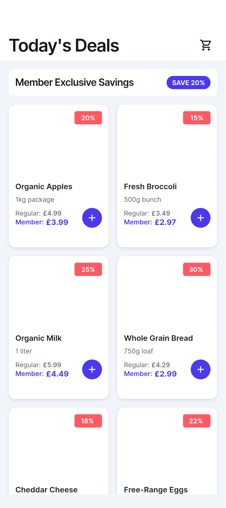

# AnyLoy – Mobile Loyalty Application

## 📱 Overview

AnyLoy is a cross-platform mobile loyalty application designed to enhance customer engagement and retention for retail businesses.

## 👩‍💻 My Role

* Led end-to-end application development
* Designed UI/UX using Figma
* Developed mobile application using Flutter
* Integrated backend services using Firebase and APIs

## 🚀 Key Features

* Customer rewards and points system
* Offers and promotions
* Redemption functionality
* User-friendly mobile interface

## 🛠️ Tech Stack

* Flutter
* Firebase
* REST APIs
* Figma

## 📈 Impact

* Increased customer retention by 25%
* Improved overall user engagement
  
## 📸 Screenshots

## 🔒 Note

Due to confidentiality agreements, source code and detailed implementation are not publicly available.
